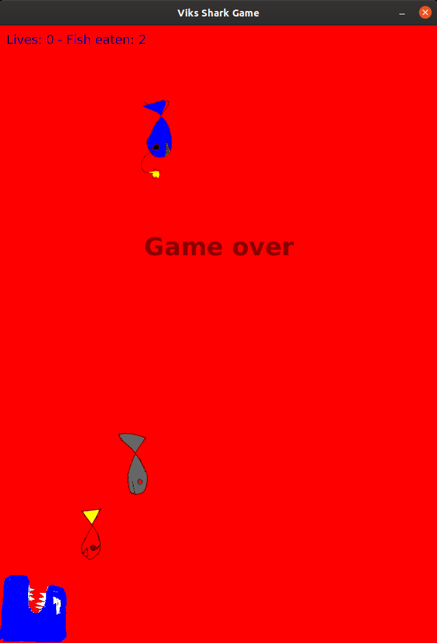

# JavaFX Game - Shark attack

A JavaFX game developed together with my 9y old son Vik, his idea and drawings. 

I'm just here for the programming ;-)
No rocket science, just our very first attempt to make a JavaFX game with [the FXGL game engine](https://github.com/AlmasB/FXGL) made by [Almas Baimagambetov](https://twitter.com/AlmasBaim).

